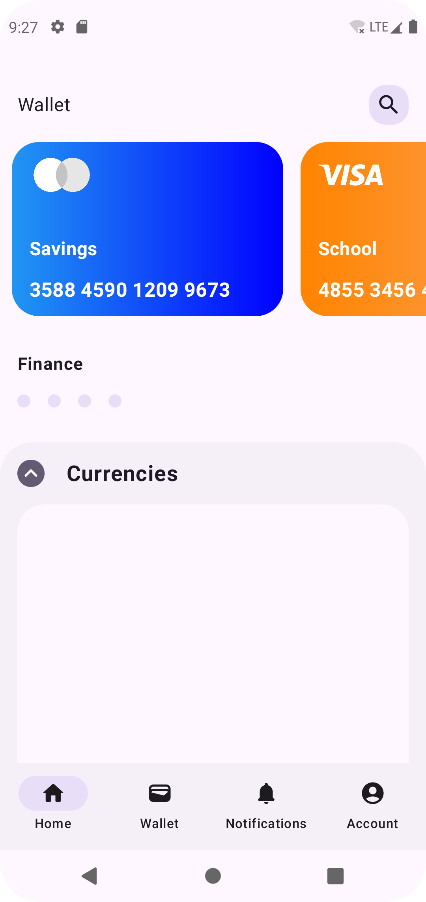

# Banking App UI - Jetpack Compose
Banking App UI made with Jetpack Compose
- This is a practice on key aspects in Jetpack Compose.
- The implementation only touches on core elements, and can be improved into other functions.

## Screenshots

## Credit/Reference
- All credit goes to [Ahmed Guedmioui](https://github.com/ahmed-guedmioui), who's work makes the main section of this Jetpack Compose practice.
- YouTube Video for the steps is by [Ahmed Guedmioui YouTube Channel](https://www.youtube.com/watch?v=pCy93IdWr9s)

## Wakatime
